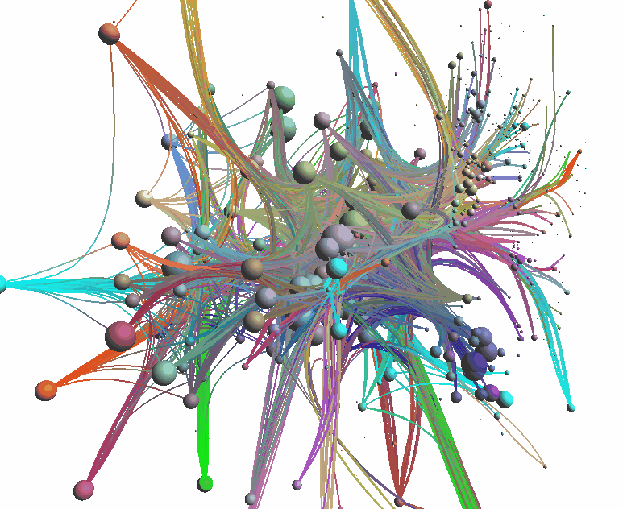
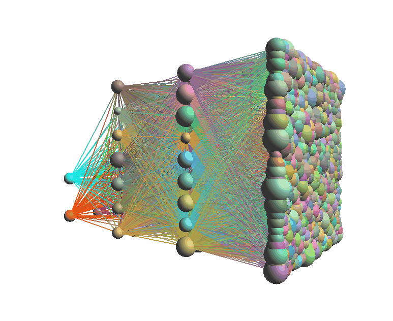
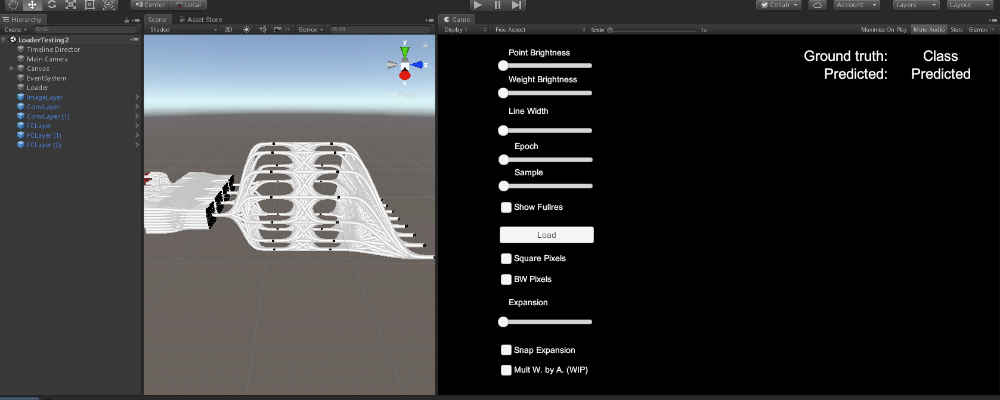
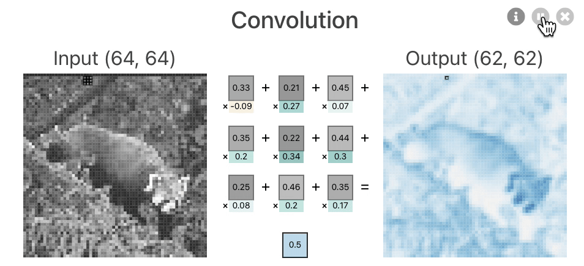
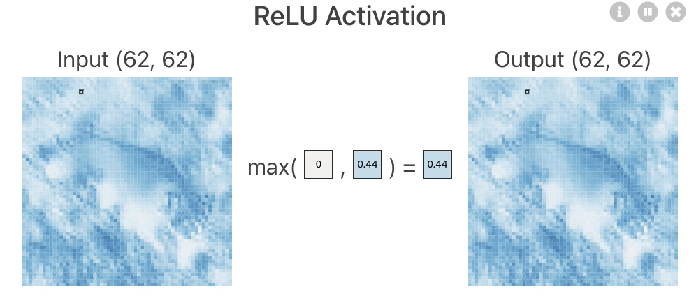
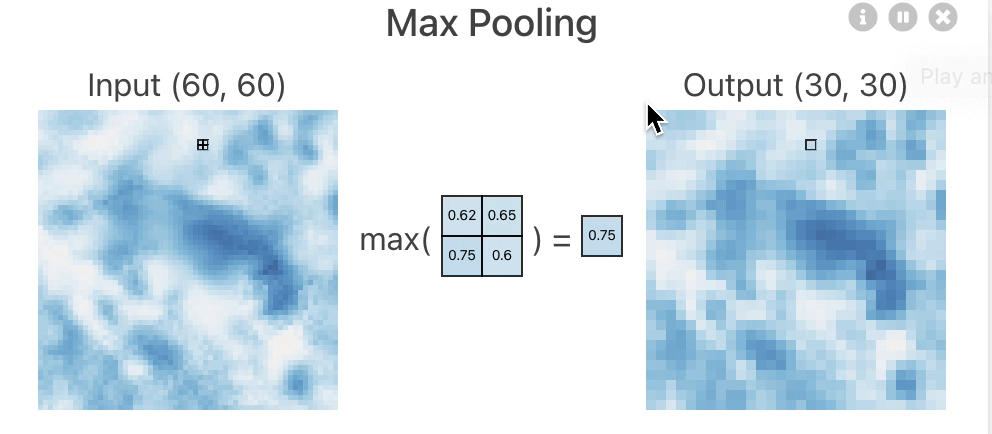
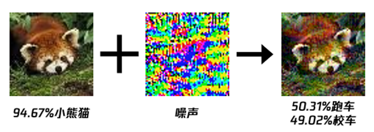
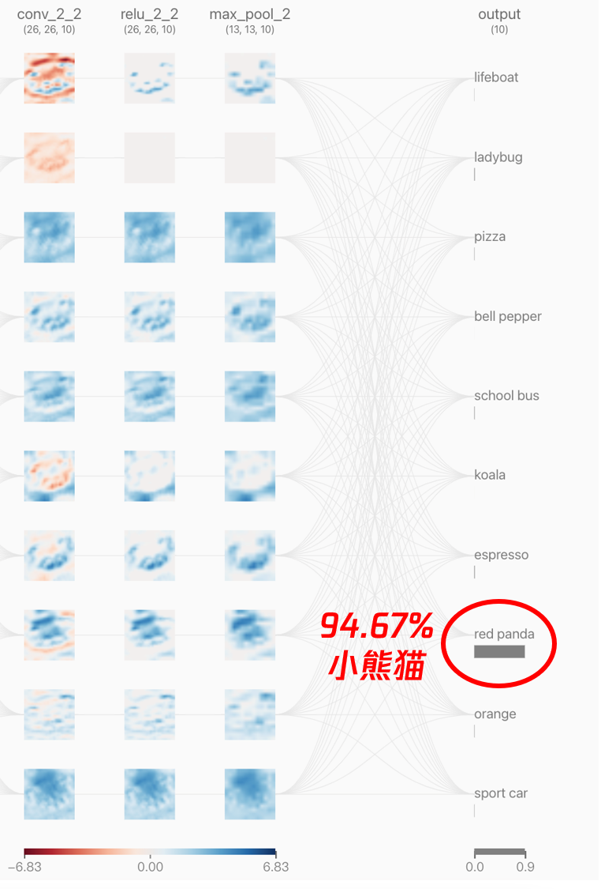
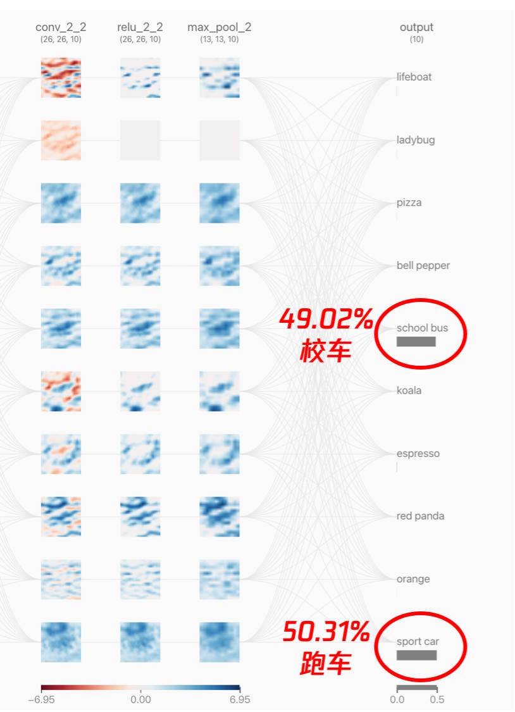
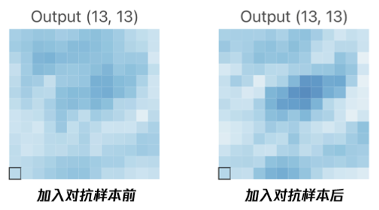

# AI可视化及对抗样本演示
- [模型结构动画](#模型结构动画)
- [训练过程可视化](#训练过程可视化)
- [CNN原理演示](#模型结构演示)
- [对抗样本产生](#对抗样本产生)
- [对抗样本可视化](#对抗样本可视化)
- [参考资料](#参考资料)
- [工具](#工具)

## 模型结构动画

我们应用开源的[神经网络的结构和参数可视化](#神经网络的结构和参数可视化)代码，运行`python start_tool.py`命令，载入一个处理过的模型(storage/data/default/*.pro.npz),可清晰的看到网络的层次化结构:




如果我们选择`generate_network`,
便能得到一个未经训练的原始模型：



可见训练的过程，就是将所有的线设置成合适的值的过程。

## 训练过程可视化

这里我们借助于stefsietz大佬的[Unity3D](#基于Unity的神经网络训练过程可视化)开源项目，配置好Unity环境后，打开案例里面的场景，便能看到下面这个工作区：



运行Game,载入训练好的转换后的模型文件夹jsons，可以动态的拖拽模型：


## CNN原理演示

这里使用佐治亚理工中国博士出品的[CNN解释器](#CNN原理可视化)，动态的感受一下CNN中几个基本组件原理：

- 卷积：自动提取局部特征



- 激活：对特征进行非线性映射



- 池化：特征采样，信息抽象



- 全连接，计算分类概率


## 对抗样本产生

这里使用一个简单的FGSM方法产生一个对抗样本。

我们首先读取一张小熊猫图片，载入已训练好的`tiny_vgg`模型，得到梯度后，使用梯度符号*扰动，叠加到原始图像上，便得到对对抗样本。




``` python
loss_object = tf.keras.losses.CategoricalCrossentropy()
with tf.GradientTape(persistent=True) as tape:
    tape.watch(image_batch)
    predictions = tiny_vgg(image_batch)
    loss = loss_object(label_batch, predictions)
gradients = tape.gradient(loss, image_batch)
signed_grad = tf.sign(gradients)

epsilon, prediction = 0.01, True
label_true = predictions[0].numpy().argmax()

while prediction:
    adv_img = tf.add(image_batch, epsilon * signed_grad)
    adv_img = tf.clip_by_value(adv_img, 0, 1)
    label_pred = tiny_vgg(adv_img)[0].numpy().argmax()
    if label_pred == label_true:
        epsilon += 0.0007
```

## 对抗样本可视化

首先看看原始的小熊猫图片在神经网络中的一个特征分布情况：



再看看小熊猫图片被加入对抗样本后的特征分布情况：



可以清楚看到，两者的预测结果截然不同，我们仔细放大下最后一个max_pooling层第三个filter提取的特征差异（**颜色深浅**）：




## 参考资料
### 神经网络的结构和参数可视化 
https://github.com/julrog/nn_vis 
### 基于Unity的神经网络训练过程可视化
https://github.com/stefsietz/nn-visualizer
### CNN原理可视化
https://github.com/poloclub/cnn-explainer
### MNIST数据集分类模型可视化交互
https://github.com/aharley/nn_vis

## 工具
- [Unity3D](https://unity3d.com/get-unity/download): Unity3D工具
- [Kap](https://getkap.co/): Mac下Gif动图录频工具
- [ScreenToGif](https://www.screentogif.com/): Windows下Gif动图录频工具